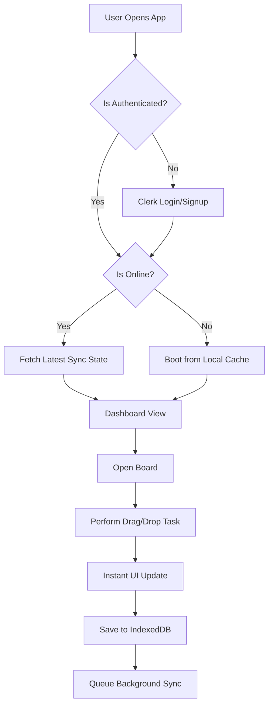
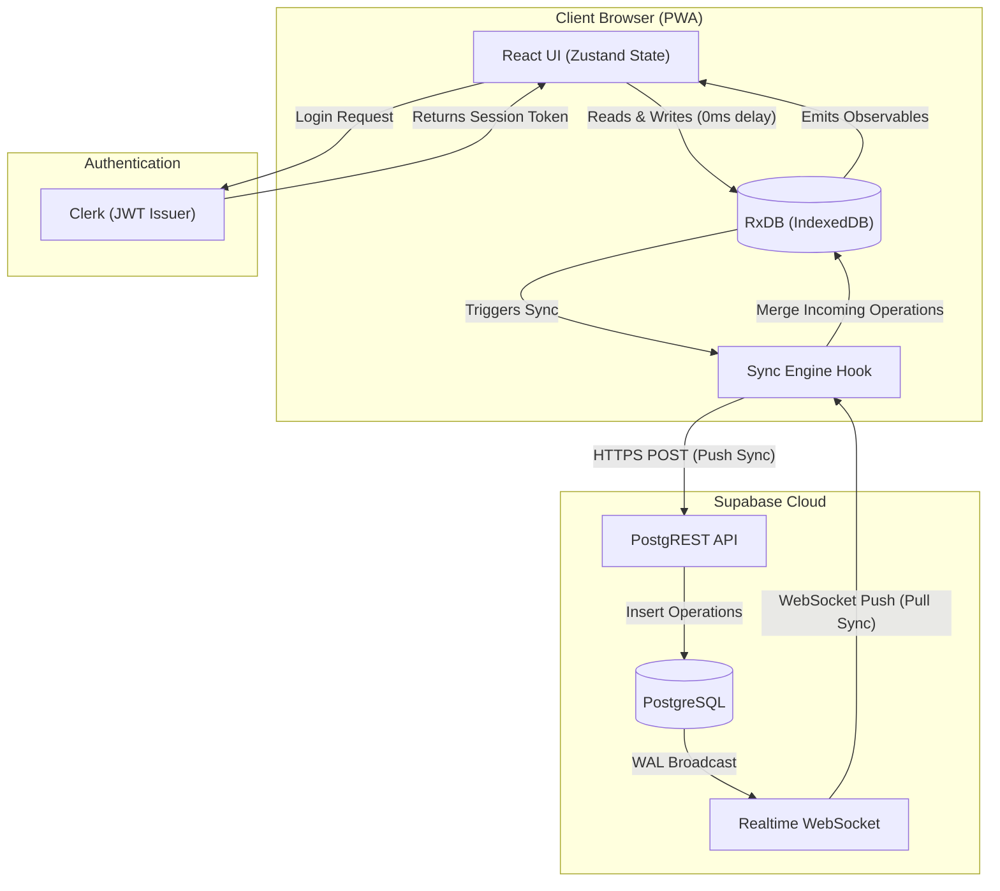
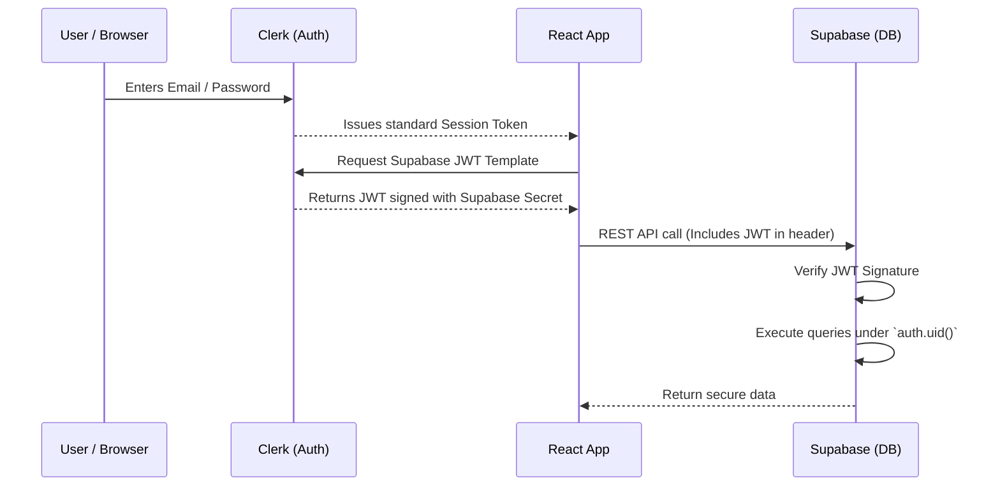
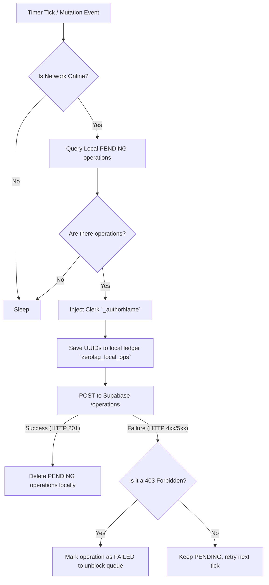
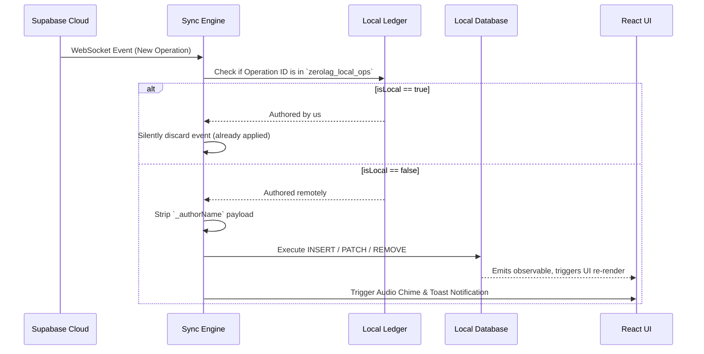
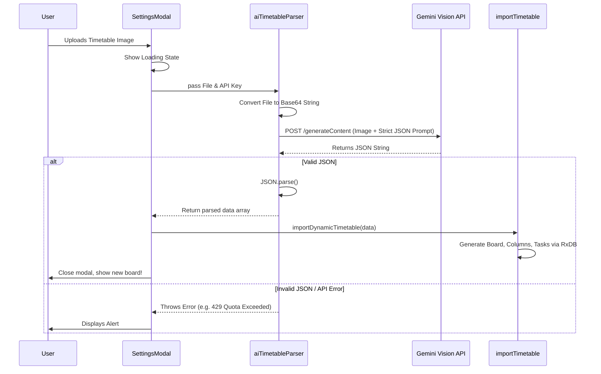

# ⚡ ZeroLag

<p align="center">
  <em>A modern, blazing-fast, offline-first collaborative task management application.</em>
</p>

---

ZeroLag allows you to seamlessly manage your tasks, create project boards, and collaborate with your team in real-time. Built entirely around a **local-first** architecture, the application works completely offline and instantly syncs all changes the moment you reconnect to the internet—resulting in zero latency and zero loading spinners.

## 🏗️ 1. Architecture Philosophy: Local-First

Traditional web applications follow a Client-Server model: the user clicks a button, a network request is sent to a backend, and the UI waits for a response (displaying a spinner) before updating. 

ZeroLag abandons this model for a **Local-First Architecture**. 
1. The primary database lives in the browser (IndexedDB).
2. All read/write operations execute against this local database with 0ms latency.
3. The UI updates instantly via reactive subscriptions.
4. A background **Sync Engine** propagates these local mutations to a central cloud server, which then broadcasts them to other connected devices.

---

## 🔄 2. The Sync Engine (`useSyncEngine.tsx`)

The Sync Engine is the heart of ZeroLag, ensuring that the local database remains synchronized with the remote PostgreSQL database (Supabase) and other active clients.

### 2.1 The Operation Queue
Instead of directly modifying remote rows (e.g., `UPDATE tasks SET title = 'x'`), ZeroLag uses **Event Sourcing**. Every mutation generates an `operation` record in the local database:

```json
{
  "id": "uuid-v4",
  "type": "UPDATE",
  "entity": "TASKS",
  "entityId": "task-123",
  "payload": { "title": "New Title" },
  "status": "PENDING",
  "timestamp": "2026-07-06T12:00:00.000Z"
}
```

### 2.2 Synchronization Loop
The sync engine operates continuously in the background:
1. **Local Observation**: It subscribes to the local `operations` collection: `db.operations.$.subscribe(...)`.
2. **Debouncing**: When a local operation is detected, a 1-second debounce timer (`syncTimeoutRef`) begins. This batches rapid changes (like typing a description or dragging tasks) into a single network request.
3. **Push to Remote**: The engine queries all operations where `status: 'PENDING'`. It filters out local metadata, resolves existing IDs to avoid unique constraint violations, and bulk-inserts them into the Supabase `operations` table.
4. **Cleanup**: Upon a successful remote insert, the pending operations are wiped from the local device to keep IndexedDB lean.

### 2.3 Real-Time Broadcasts (WebSockets)
ZeroLag utilizes Supabase Realtime to establish a continuous WebSocket connection. 
```typescript
supabase.channel('public:operations')
  .on('postgres_changes', { event: 'INSERT', schema: 'public', table: 'operations' }, async (payload) => {
     await handleRemoteOperation(payload.new);
  }).subscribe();
```
When a remote client inserts a new operation into PostgreSQL, Supabase broadcasts it down this channel. The local client receives the operation, parses the payload, and applies the patch (`doc.patch(cleanData)`) directly to its local RxDB instance. Because the React UI is observing RxDB, it re-renders instantly.

### 2.4 Reconnection Bootstrap
When a user opens the app after being offline, they may have missed WebSocket events.
The app fetches all remote operations where `timestamp > last_sync_timestamp`. It replays these operations chronologically to "catch up" the local database state to the current global state before relying on WebSockets again.

---

## 🎨 3. UI & Drag-and-Drop Optimization

ZeroLag implements complex, nested drag-and-drop mechanics using `@dnd-kit`, specifically tailored for both desktop mice and mobile touch screens.

### 3.1 Sensor Configuration
To ensure mobile scrollability isn't blocked by draggable task cards, `Board.tsx` explicitly configures distance sensors:
```typescript
const sensors = useSensors(
  useSensor(MouseSensor, { activationConstraint: { distance: 5 } }),
  useSensor(TouchSensor, { activationConstraint: { distance: 5 } })
);
```
This forces the user to drag their finger at least 5 pixels before the task is "picked up", allowing normal vertical scrolling to continue uninterrupted.

### 3.2 Optimistic Drag Updates
When a task is dragged over another column, the UI updates optimistically *before* the drag ends.
- **`handleDragOver`**: Uses `@dnd-kit/sortable`'s `arrayMove` to visually snap the task into the new column instantly.
- **`handleDragEnd`**: Iterates through the newly ordered array and compares it to the local RxDB state. If a task's `columnId` or `position` index has changed, it issues a `patch` command to RxDB, which generates the sync operations automatically.

---

## 🗄️ 4. Local Database Schema (RxDB)

ZeroLag uses **RxDB** backed by Dexie. RxDB provides NoSQL-like collections with powerful indexing and reactive query capabilities.

### 4.1 Indexing Strategies
To keep drag-and-drop performant across hundreds of tasks, the `taskSchema` utilizes compound indexes:
```typescript
indexes: ['columnId', 'position', ['columnId', 'position']]
```
This allows the `Board` component to execute lightning-fast sorts: `db.tasks.find({ sort: [{ position: 'asc' }] })`.

### 4.2 Handling Controlled Form Inputs
A major challenge in real-time sync systems is form input tearing (e.g., user types a character, but the delayed database reactive loop overwrites the input field before the next character is typed).

ZeroLag resolves this in `TaskDetailsPanel.tsx` by decoupling local UI state from the RxDB reactive loop during focus:
```tsx
const [localTitle, setLocalTitle] = useState('');
const [isTitleFocused, setIsTitleFocused] = useState(false);

<textarea
  value={isTitleFocused ? localTitle : task.title}
  onFocus={() => { setIsTitleFocused(true); setLocalTitle(task.title); }}
  onBlur={() => setIsTitleFocused(false)}
  onChange={(e) => {
    setLocalTitle(e.target.value);
    updateField('title', e.target.value); // Syncs to DB in background
  }}
/>
```
This guarantees 60fps typing performance without losing data or cursor positioning, while still silently syncing characters to other clients.

---

## 🔒 5. Edge Authentication & Security

ZeroLag achieves total security without a custom Node.js server. 

### 5.1 Clerk JWT to Supabase Translation
1. The user signs in via Clerk's Edge Network.
2. The React client requests a specialized Supabase token: `await session.getToken({ template: 'supabase' })`.
3. This token embeds the Clerk user ID into the `sub` (subject) claim and is signed using the Supabase project's secure symmetric key.
4. The client uses this token to connect to Supabase:
   ```typescript
   const supabase = createClient(url, key, { accessToken: () => token });
   ```

### 5.2 Row-Level Security (RLS)
PostgreSQL executes queries contextually using the `auth.uid()` extracted from the JWT.
A mapping table (`board_access`) tracks which `user_id` belongs to which `board_id`.
```sql
CREATE POLICY "Users can view operations for their boards"
ON operations FOR SELECT
USING (
  EXISTS (
    SELECT 1 FROM board_access 
    WHERE board_access.board_id = operations.board_id 
    AND board_access.user_id = auth.uid()::text
  )
);
```
If a malicious user attempts to intercept WebSockets or execute REST queries for a board they haven't joined, PostgreSQL blocks the request at the database engine level, returning 0 rows.

### 5.3 Link Sharing
Board IDs are cryptographically secure `UUIDv4` strings. If a user is given a Board ID by a peer, they enter it into the UI. The RLS policy explicitly permits `INSERT` statements into `board_access`, securely adding the user to the workspace.

---

## 🌐 6. Progressive Web App (PWA) Delivery

ZeroLag is built to look and feel like a native application. 
- **vite-plugin-pwa**: Configures the Service Worker to cache JS/CSS bundles and assets for immediate offline loading.
- **Manifest**: Defines `theme_color: '#0e0e10'` to blend the mobile browser address bar directly into the app's dark theme, ensuring edge-to-edge UI immersiveness.
- **Mobile UI**: Incorporates bottom-sheet modal interactions (`TaskDetailsPanel.tsx`), rounded touch targets, and dynamic viewport height calculations to prevent the mobile virtual keyboard from breaking the layout.

---


## 📚 Comprehensive Documentation Portal

The following collapsible sections contain the complete, in-depth documentation for ZeroLag across Product, Architecture, Engineering, and Operations.

## 1. Product Strategy
*Documents outlining the 'Why' and the 'What' of ZeroLag.*
<details>
<summary><b>📄 View: Product Requirements Document (PRD)</b></summary>

# Product Requirements Document (PRD)

# ZeroLag — Local-First Project Management Platform

**Version:** 1.0
**Status:** Approved
**Target Audience:** Developers, Students, Startups, Small Teams

---

## 1. Product Overview
### Vision
Build a project management platform that feels as responsive as a native desktop application while running entirely inside the browser.

Unlike traditional SaaS apps that depend on network requests for every interaction, ZeroLag performs every action locally first and synchronizes changes with the cloud only when connectivity is available.

The result is a productivity application with:
* Zero loading spinners
* Instant interactions
* Offline-first workflow
* Conflict-aware synchronization
* Seamless multi-device experience

---

## 2. Problem Statement
Most productivity apps still rely heavily on server round trips. Users experience loading indicators, network latency, failed requests, and lost work during unstable internet. ZeroLag solves all of these through a Local-First architecture.

---

## 3. Goals
### Primary Goals
* Every interaction completes instantly
* Entire application usable offline
* Automatic background synchronization
* Native-app feel inside browser

### Secondary Goals
* Collaborative editing
* Fast startup (<100ms)
* Installable as a PWA

---

## 4. Target Users
1. **Student**: Uses Kanban board for assignments. Needs offline functionality for poor college internet.
2. **Developer**: Tracks features/bugs. Needs fast interactions similar to Linear.
3. **Startup Founder**: Uses for roadmaps and sprint planning. Needs speed and reliability.

---

## 5. Core Value Proposition
> "Your productivity should never depend on WiFi."

---

## 6. Functional Requirements (V1)
- **Authentication**: Email login, Google OAuth, JWT Authentication.
- **Board/Column/Task Management**: Full CRUD operations.
- **Drag & Drop**: Instant visual feedback without loading spinners.
- **Offline Mode**: 99% of app capabilities function offline.
- **Sync Engine**: Background synchronization and conflict resolution (LWW).
- **AI Magic Import**: Upload a schedule image and generate a Kanban board using AI.

</details>
<br>
<details>
<summary><b>📄 View: Functional Architecture Document (FAD)</b></summary>

# Functional Architecture Document (FAD)
## ZeroLag — Local-First Project Management Platform

**Version:** 1.0

---

## 1. Executive Summary
ZeroLag is a local-first project management platform designed to eliminate loading spinners and network latency. The application prioritizes immediate user feedback by persisting all interactions to a local database (IndexedDB) first, and synchronizing with a remote backend (Supabase) entirely in the background.

---

## 2. Core Functional Modules

### 2.1 Authentication & Onboarding
- **Sign Up / Sign In**: Managed entirely by Clerk.
- **Offline Boot**: If the user has authenticated previously and opens the app offline, the app boots instantly using locally cached data.

### 2.2 Workspace & Board Management
- **Dashboard**: The central hub displaying all accessible projects/boards.
- **Visual Identity**: Boards inherit a visually distinct, premium "Lumina" design system characterized by glassmorphism, deep dark themes, and electric indigo accents.

### 2.3 Kanban & Task Execution
- **Column Management**: Vertical columns (e.g., Todo, In Progress, Done).
- **Drag & Drop**: Users can visually drag tasks between columns. Resolves instantly on UI.

---

## 3. High-Level User Journey Flow



---

## 4. Key Workflows & User Journeys

### 4.1 The Offline-First Creation Flow
1. User clicks "Add Task".
2. UI instantly renders the new task card in the column.
3. System saves the task to the local database (RxDB).
4. System queues a `CREATE` operation.
5. (Background) System attempts to push the operation to the cloud. If offline, the queue halts safely.

### 4.2 The Real-Time Collaboration Flow
1. User A moves a task from "Todo" to "Done".
2. Operation is instantly saved locally and synced to the cloud.
3. Cloud broadcasts the operation via WebSocket.
4. User B's application receives the broadcast.
5. User B's application verifies the operation is remote, triggers an Audio Chime, displays a Global Toast Notification, and updates the UI instantly.

</details>
<br>
## 2. Architecture & Security
*High-level system designs, database schemas, and security models.*
<details>
<summary><b>📄 View: System Architecture Document (SAD)</b></summary>

# System Architecture Document (SAD)
## ZeroLag — Local-First Project Management Platform

**Version:** 1.0

---

## 1. Introduction
This System Architecture Document provides a high-level overview of the ZeroLag infrastructure, network topology, and core data flow. ZeroLag abandons traditional client-server request/response paradigms in favor of a "Local-First, Event-Driven Sync" architecture.

---

## 2. High-Level Architectural Paradigm
ZeroLag operates on an **Offline-First / Local-First** paradigm. 
- **The Browser is the Primary Database**: The React frontend does not read from the cloud; it reads exclusively from an in-browser database (IndexedDB via RxDB).
- **Asynchronous Replication**: Changes are written locally and immediately reflected in the UI. A background Sync Engine acts as a sidecar, pushing local operations to the cloud and pulling remote operations down to the client.
- **Event-Driven Subscriptions**: The application subscribes to a WebSocket channel to receive remote database changes in real time.

---

## 3. Network Boundaries & Data Flow



---

## 4. System Components & Topology

### 4.1 Client-Side Application (PWA)
- **Environment**: Web Browser (V8/WebKit).
- **Core Framework**: React (Vite) as a Single Page Application (SPA).
- **Local Storage**: IndexedDB is used for structured persistent storage, wrapped by `RxDB` (Reactive Database) which provides observables for UI reactivity. `localStorage` is used for ephemeral UI preferences and the sync engine's ledger (`zerolag_local_ops`).

### 4.2 Authentication Layer (Clerk)
- **Integration**: The client app communicates directly with Clerk APIs. Clerk issues JSON Web Tokens (JWTs) which are stored in memory and passed to Supabase for authorized requests.

### 4.3 Remote Backend & Database (Supabase)
- **Role**: Acts as the central "Source of Truth" and the event-broadcaster for all connected peers.
- **Authorization**: Enforced exclusively via PostgreSQL Row Level Security (RLS) using the Clerk JWT context.

</details>
<br>
<details>
<summary><b>📄 View: Technical Architecture Document (TAD)</b></summary>

# Technical Architecture Document (TAD)
## ZeroLag — Local-First Project Management Platform

**Version:** 1.0

---

## 1. Technology Stack

### 1.1 Core Framework
- **React (18+)**: Component-based UI library.
- **Vite**: Ultra-fast build tool and development server.
- **TypeScript**: Strictly typed JavaScript to guarantee reliable data structures and component props.

### 1.2 Local Database Layer
- **RxDB (Reactive Database)**: Acts as the primary data store. It allows components to subscribe to queries so that any change in the database immediately re-renders the UI without manual state lifting.
- **Dexie.js**: The underlying storage adapter used by RxDB to interface with the browser's native IndexedDB.

### 1.3 State Management
- **Zustand**: A minimalistic, non-opinionated global state manager. It is used exclusively for *ephemeral UI state* (e.g., `selectedTaskId`, `isOffline`, `syncStatus`).
- **RxDB Observables**: Used for *persistent application data* (e.g., Boards, Columns, Tasks). 

### 1.4 Styling & UI
- **TailwindCSS (v4)**: Utility-first CSS framework handling all visual styling.
- **Framer Motion**: powers the fluid spring animations and physics-based drag-and-drop mechanics.
- **Lucide-React**: The icon library used universally across the application.
- **dnd-kit**: A lightweight, modular drag-and-drop toolkit utilized in the Kanban board.
- **React-Markdown**: Used within the Task Details Panel to render GitHub-Flavored Markdown descriptions.

---

## 2. Component Architecture

### 2.1 Entry Point (`App.tsx`)
Initializes the `DatabaseProvider` and `SyncProvider` context. Contains the main routing logic and renders global toast notifications.

### 2.2 Board View (`KanbanBoard.tsx`)
Subscribes to RxDB collections (`boards`, `columns`, `tasks`). Uses `@dnd-kit/core` `DndContext` wrapping the entire column grid. Handles optimistic UI updates natively.

### 2.3 Task Details (`TaskDetailsPanel.tsx`)
A heavily animated side-panel powered by `framer-motion`. Renders `ReactMarkdown` and supports file attachments. File attachments are converted to Base64 strings and stored directly in the IndexedDB document before syncing.

---

## 3. Middleware & Interceptors
ZeroLag utilizes RxDB collection hooks (`postInsert`, `postSave`, `postRemove`) to capture every database mutation.

When a user modifies a task:
1. `db.tasks.patch()` is called.
2. The `postSave` middleware intercepts the action.
3. The middleware constructs an `operation` object representing the change.
4. The operation is appended to the `operations` table with a `PENDING` status.
5. The Sync Engine periodically sweeps the `operations` table for `PENDING` items to push to the cloud.

</details>
<br>
<details>
<summary><b>📄 View: Security & Authentication</b></summary>

# Security & Authentication

ZeroLag completely eliminates the need for a custom Node.js backend by securely integrating **Clerk** (Edge Authentication) directly with **Supabase** (Database) using Row-Level Security (RLS).

---

## 1. Authentication Flow (Clerk to Supabase)



---

## 2. Authorization Flow (Supabase RLS)
When the React client makes a request to Supabase, it attaches the Clerk JWT.
Supabase verifies the JWT signature. Once verified, it executes SQL queries under the context of the user whose ID is inside the JWT (`auth.uid()`).

### Row-Level Security (RLS) Policies
By default, all tables (`boards`, `board_access`, `operations`) are completely locked down. Data is only accessible if the user meets strict conditions:

#### Board Access Model
We use a mapping table called `board_access` to link users to projects.

```sql
CREATE TABLE board_access (
  board_id VARCHAR(255) NOT NULL,
  user_id VARCHAR(255) NOT NULL,
  PRIMARY KEY (board_id, user_id)
);
```

#### Policy Examples
When a user attempts to read an `operation` to sync their local database, Supabase runs this policy:
```sql
CREATE POLICY "Users can view operations for their boards"
ON operations FOR SELECT
USING (
  EXISTS (
    SELECT 1 FROM board_access 
    WHERE board_access.board_id = operations.board_id 
    AND board_access.user_id = auth.uid()::text
  )
);
```
If the user's `auth.uid()` is not found in `board_access` for that specific board, the query returns 0 rows. 

---

## 3. Link-Sharing Security
ZeroLag allows users to invite collaborators via a "Project Code" (the Board ID).
- Board IDs are standard **UUIDv4** strings.
- UUIDv4 strings are 128-bit numbers, meaning they are cryptographically impossible to guess.
- Because the ID cannot be guessed, treating the ID itself as a bearer token for joining a project is a secure model (similar to Google Drive "Anyone with the link").

</details>
<br>
## 3. Engineering Deep Dives
*In-depth technical algorithms, flowcharts, and engine logic.*
<details>
<summary><b>📄 View: Feature Technical Logic (FTL)</b></summary>

# Feature Technical Logic (FTL)
## ZeroLag — Local-First Project Management Platform

**Version:** 1.0

---

## 1. Introduction

This document details the precise algorithmic flows that govern the most complex features of ZeroLag. By understanding these flows, engineers can debug synchronization races, resolve conflicts, and extend the local-first engine.

*Note: For detailed flowcharts on the Sync Engine and AI Import, see their respective sub-documents.*

---

## 2. Feature: The Audio-Visual Notification System

If a remote operation arrives and `isLocal == false` (the user did not author the change), and the user has notifications enabled:

1. **Audio Engine**: The app generates an 800Hz-1200Hz sine wave using the `window.AudioContext`.
2. **Throttle**: It checks a `lastNotificationTime` variable. If a sound played within the last 2000ms, it skips the audio to prevent overlapping audio spam.
3. **Toast Construction**: It extracts the `_authorName` and constructs a dynamic message (e.g., *"Jane Doe added a new task."*).
4. **UI Trigger**: It dispatches the message to Zustand (`setGlobalToastMessage`), which triggers a sliding notification in the top right of the viewport.

---

## 3. Feature: The Application Phase (Optimistic UI updates)

When `handleRemoteOperation()` intercepts a remote change, it strips the `_authorName` out of the incoming payload to prevent database pollution.
It executes an RxDB `insert`, `patch`, or `remove` based on the operation type.
Because the React UI components are subscribed directly to RxDB collections using `useRxData()`, the UI components magically re-render themselves the millisecond the local database is updated. No complex state lifting or `useEffect` polling is required.

</details>
<br>
<details>
<summary><b>📄 View: Sync Engine Architecture</b></summary>

# Sync Engine Architecture

The sync engine (`useSyncEngine.tsx`) is the heart of ZeroLag's offline-first capabilities. It operates as a bidirectional gateway between the RxDB local storage and the Supabase cloud.

---

## 1. The Push Cycle (Local -> Cloud)
When the user is online, the sync engine executes on a polling interval.



---

## 2. The Pull Cycle & Real-Time Sync (Cloud -> Local)

ZeroLag uses WebSockets to receive remote changes instantly.



---

## 3. Conflict Resolution
Conflicts occur when two users modify the same entity simultaneously while offline, and both attempt to sync when they regain connectivity.

### Last-Write-Wins (LWW)
ZeroLag currently utilizes a timestamp-based LWW resolution strategy.
- Every `patch` or `insert` command executed by `handleRemoteOperation` operates strictly on the entity ID.
- Since the Sync Engine processes operations sequentially based on the `timestamp` they were recorded, the operation with the latest timestamp is applied last, effectively overwriting older, conflicting changes.

</details>
<br>
<details>
<summary><b>📄 View: AI Magic Import Flow</b></summary>

# AI Magic Import Flow

The AI Magic Import feature allows users to upload a raw image of a timetable/schedule and instantly convert it into a fully interactive Kanban board.

---

## 1. Technical Implementation

The feature relies on Google's GenAI Vision API (`gemini-2.5-flash`). It is designed to run completely locally in the browser, passing the Base64 image data directly to Google's API, rather than routing through a middle-tier backend.



---

## 2. The Strict JSON Prompting Strategy
To ensure the vision model does not hallucinate markdown wrappers or conversational text, we pass `config: { responseMimeType: "application/json" }` directly into the `generateContent` configuration.

This enforces the engine to return structurally valid JSON, preventing `SyntaxError: Expected ',' or '}'` exceptions during parsing.

### Fallback Sanitization
Even with the mime-type configuration, we run a fallback regex to strip out any potential markdown backticks that the model might accidentally include in edge cases:

```typescript
const cleanText = text.replace(/```json/gi, '').replace(/```/g, '').trim();
return JSON.parse(cleanText);
```

</details>
<br>
## 4. Operations
*Setup, deployment, and infrastructure guidelines.*
<details>
<summary><b>📄 View: Setup & Deployment</b></summary>

# Setup & Deployment

This guide covers how to set up ZeroLag for local development and how to deploy it to production.

---

## 1. Local Development

### Prerequisites
- **Node.js** (v18+)
- **Clerk Account** (Create a project at clerk.com)
- **Supabase Account** (Create a project at supabase.com)
- **Google AI Studio** (For the Gemini Vision API)

### Environment Variables
Create a `.env.local` file in the root directory:
```env
VITE_CLERK_PUBLISHABLE_KEY=pk_test_...
VITE_SUPABASE_URL=https://your-project.supabase.co
VITE_SUPABASE_ANON_KEY=eyJhbGci...
VITE_GEMINI_API_KEY=AIzaSy...
```

### Supabase Configuration
Execute the following SQL in your Supabase SQL Editor:
1. **Schema**: Create the `boards`, `operations`, and `board_access` tables.
2. **RLS**: Apply the Row-Level Security policies.

### Clerk Configuration
1. Navigate to **Clerk Dashboard > JWT Templates**.
2. Create a new template named `supabase`.
3. Set **Signing algorithm** to `HS256`.
4. Enable **Custom signing key**.
5. Paste your Supabase **Legacy JWT Secret**.

### Running the App
```bash
npm install
npm run dev
```

---

## 2. Production Deployment

Because ZeroLag is a 100% static React application (Serverless / Local-first architecture), it can be hosted for free on edge networks.

### Deploying to Vercel
1. Push your code to a GitHub repository.
2. Log in to [Vercel](https://vercel.com) and click **Add New Project**.
3. Import your GitHub repository.
4. In the **Environment Variables** section, add your `VITE_CLERK_PUBLISHABLE_KEY`, `VITE_SUPABASE_URL`, `VITE_SUPABASE_ANON_KEY`, and `VITE_GEMINI_API_KEY`.
5. Click **Deploy**.

Vercel will automatically run `npm run build` (Vite) and deploy the static assets to their global edge CDN.

</details>
<br>

## 🤝 Contributing
Contributions are welcome! Please ensure you have read the architecture documentation above before submitting pull requests to ensure alignment with the offline-first sync engine logic.

## 📄 License
MIT License.
