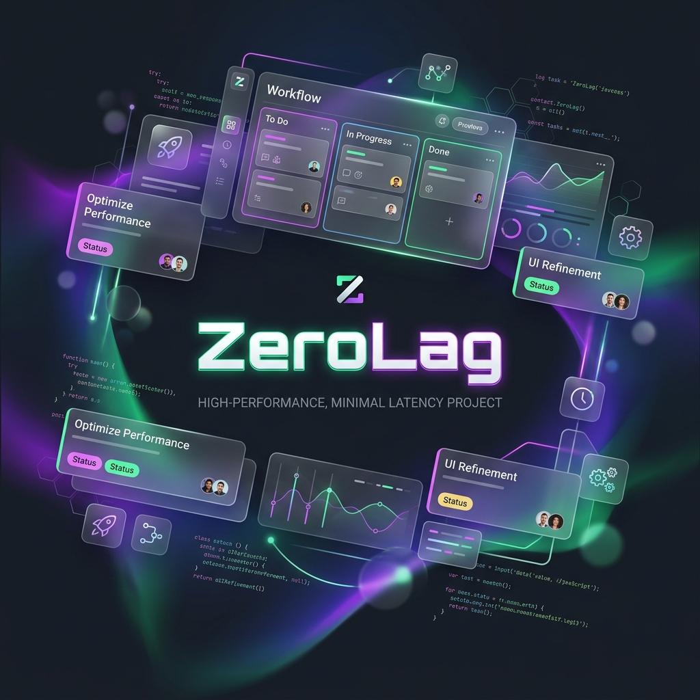
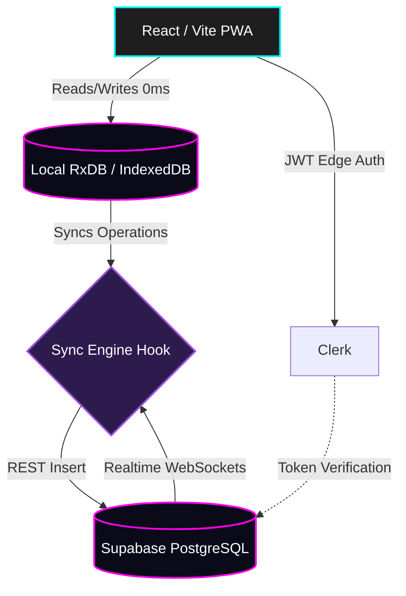

<!-- markdownlint-disable MD033 MD041 MD023 -->

  

# ⚡ ZeroLag: Offline-First Collaborative Task Management

_A blazing-fast, local-first project management platform built with React, RxDB, Supabase, and pure magic._

---

## 📑 Table of Contents

- [📖 Introduction](#-introduction)
- [✨ Key Features](#-key-features)
- [💼 Professional & Enterprise Use Cases](#-professional--enterprise-use-cases)
- [📚 Documentation Index](#-documentation-index)
- [📲 Install as a Mobile App (PWA)](#-install-as-a-mobile-app-pwa)
- [🛠️ Quick Tech Stack Overview](#️-quick-tech-stack-overview)
- [🔒 Security & Privacy Guarantee](#-security--privacy-guarantee)

---

## 📖 Introduction

**ZeroLag** is a cutting-edge, real-time collaborative task management application designed from the ground up for absolute speed and offline reliability. Unlike traditional web apps, ZeroLag adopts a **Local-First Architecture**. When you interact with the app, all read/write operations execute against a local browser database with 0ms latency. A background sync engine then seamlessly propagates these changes to a central cloud server, broadcasting them to other connected team members in real time.

No loading spinners. No network dependency. Just pure, instant task management.

---

## ✨ Key Features

- **⚡ Zero Latency UI:** All data is read from and written to a local IndexedDB via RxDB, ensuring instant UI updates regardless of internet speed.
- **🔄 Offline-First Sync Engine:** Event-sourced operation logging that batches and syncs mutations gracefully in the background the moment you reconnect.
- **🤝 Real-Time Collaboration & Presence:** Powered by Supabase Realtime WebSockets to instantly broadcast changes and display live collaborator avatars and cursors.
- **🖐️ Optimized Drag & Drop:** Complex, nested drag-and-drop mechanics tailored for both desktop mice and mobile touch screens using `@dnd-kit`.
- **✨ AI Magic Import:** Utilize the Gemini Vision API to instantly parse images of physical whiteboards or written timetables into digital tasks.
- **🎥 1-Click Aurameet Video Conferencing:** Seamlessly launch ephemeral, zero-log video meeting rooms directly from your project board, fully optimized for PWAs.
- **📱 Progressive Web App (PWA):** Fully installable mobile app experience. Works offline, launches in full-screen standalone mode, and handles deep links perfectly.
- **🎨 Premium Mesh-Gradient Glassmorphism:** A high-end, modern UI built with Tailwind CSS, featuring rich dark-mode interfaces, fluid animations, and stunning project cards.
- **🚀 Production-Ready FSD Architecture:** Clean Feature-Sliced Design (FSD) modular architecture, Edge authentication with Clerk, strict Row-Level Security (RLS) policies, and highly optimized reactive subscriptions.

---

## 💼 Professional & Enterprise Use Cases

ZeroLag is engineered for high-performance teams where speed and offline access are critical.

- **✈️ Remote & Traveling Teams:** Continue working seamlessly on flights, trains, or in poor network areas. Changes sync automatically when a connection is restored.
- **🏃 Agile Startups:** Manage complex sprints and roadmaps without the friction of slow SaaS load times.
- **🛡️ Secure Project Workspaces:** Utilize Clerk JWT-to-Supabase integration and strict Row-Level Security to ensure sensitive project data is completely isolated.

---

## 📚 Documentation Index

To keep this README clean, detailed technical documentation has been divided into specialized modules packed with architectural flowcharts and diagrams:

### 1. [🏗️ Product & Architecture](docs/index.md)
Discover the high-level system designs, including:
- **[Functional Architecture Document (FAD)](docs/1-product/FAD.md):** The core use cases and product vision.
- **[System Architecture Document (SAD)](docs/2-architecture/SAD.md):** Database schemas and Local-First topology.
- **[Security & Authentication](docs/2-architecture/SECURITY.md):** How Clerk edge auth maps to PostgreSQL RLS.

### 2. [⚙️ Engineering Deep Dives](docs/index.md)
Dive into the technical mechanics, including:
- **[Sync Engine Architecture](docs/3-engineering/sync-engine.md):** The event-sourced operational logic and debounce queues.
- **[Feature Technical Logic (FTL)](docs/3-engineering/FTL.md):** Detailed algorithms for core feature delivery.
- **[AI Magic Import Flow](docs/3-engineering/ai-magic-import.md):** Generative AI parsing pipelines.
- **[Aurameet Integration](docs/3-engineering/aurameet-integration.md):** PWA-compatible, deterministic 1-click ephemeral video conferencing.

### 3. [🚀 Deployment & Setup Guide](docs/4-operations/SETUP.md)
Learn how to run ZeroLag, including:
- **Local Setup:** Running Vite, configuring Clerk, and provisioning Supabase.
- **Production Deployment:** Hosting the static application on global edge networks like Vercel.

---

## 📲 Install as a Mobile App (PWA)

ZeroLag is a fully configured Progressive Web App (PWA). You can install it directly to your device for a native-like offline experience:

- **Android (Chrome):** Open the site, tap the menu (⋮), and select **"Install App"**.
- **iOS (Safari):** Open the site in Safari, tap the **Share** button, and select **"Add to Home Screen"**.
- **Desktop (Chrome/Edge):** Click the **Install** icon on the right side of the URL address bar.

---

## 🛠️ Quick Tech Stack Overview

- **Frontend & UI:** React 19, Tailwind CSS v4, Framer Motion, Lucide Icons, DnD-Kit
- **Local Database:** RxDB, Dexie (IndexedDB)
- **Cloud Backend:** Supabase (PostgreSQL, Realtime, RLS)
- **Authentication:** Clerk (Edge Networking, JWT generation)
- **AI Integrations:** Google Gemini API
- **Build Tooling:** Vite, TypeScript, Oxlint

---

## 🔒 Security & Privacy Guarantee

ZeroLag utilizes strict cryptographic verification for all data access. When you log in via Clerk, a specialized JWT is generated that PostgreSQL (Supabase) decodes natively. Row-Level Security (RLS) policies are evaluated at the database engine level, ensuring that it is mathematically impossible for users to access or sync workspace data they have not been explicitly granted access to.

> **⚠️ Security Warning:** If any sensitive credentials (API keys, database URLs, etc.) were previously hardcoded in the source code before migrating to `.env` variables, those values are still present in your Git history. You must **immediately rotate** any previously hardcoded secrets to prevent unauthorized access.
