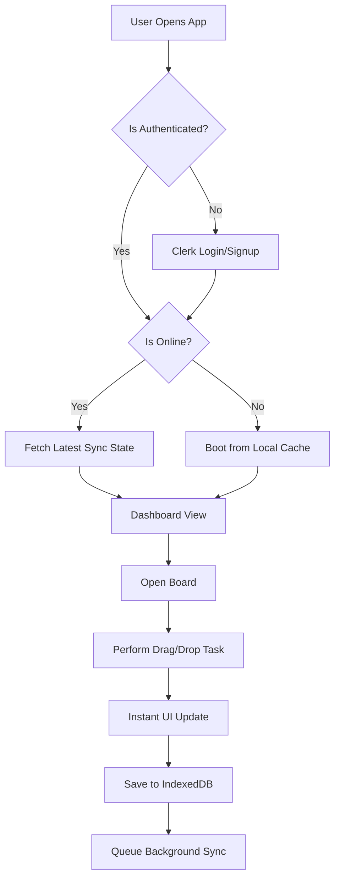

# Functional Architecture Document (FAD)
## ZeroLag — Local-First Project Management Platform

**Version:** 1.0

---

## 1. Executive Summary
ZeroLag is a local-first project management platform designed to eliminate loading spinners and network latency. The application prioritizes immediate user feedback by persisting all interactions to a local database (IndexedDB) first, and synchronizing with a remote backend (Supabase) entirely in the background.

---

## 2. Core Functional Modules

### 2.1 Authentication & Onboarding
- **Sign Up / Sign In**: Managed entirely by Clerk.
- **Offline Boot**: If the user has authenticated previously and opens the app offline, the app boots instantly using locally cached data.

### 2.2 Workspace & Board Management
- **Dashboard**: The central hub displaying all accessible projects/boards.
- **Visual Identity**: Boards inherit a visually distinct, premium "Lumina" design system characterized by glassmorphism, deep dark themes, and electric indigo accents.

### 2.3 Kanban & Task Execution
- **Column Management**: Vertical columns (e.g., Todo, In Progress, Done).
- **Drag & Drop**: Users can visually drag tasks between columns. Resolves instantly on UI.

---

## 3. High-Level User Journey Flow

---

## 4. Key Workflows & User Journeys

### 4.1 The Offline-First Creation Flow
1. User clicks "Add Task".
2. UI instantly renders the new task card in the column.
3. System saves the task to the local database (RxDB).
4. System queues a `CREATE` operation.
5. (Background) System attempts to push the operation to the cloud. If offline, the queue halts safely.

### 4.2 The Real-Time Collaboration Flow
1. User A moves a task from "Todo" to "Done".
2. Operation is instantly saved locally and synced to the cloud.
3. Cloud broadcasts the operation via WebSocket.
4. User B's application receives the broadcast.
5. User B's application verifies the operation is remote, triggers an Audio Chime, displays a Global Toast Notification, and updates the UI instantly.
