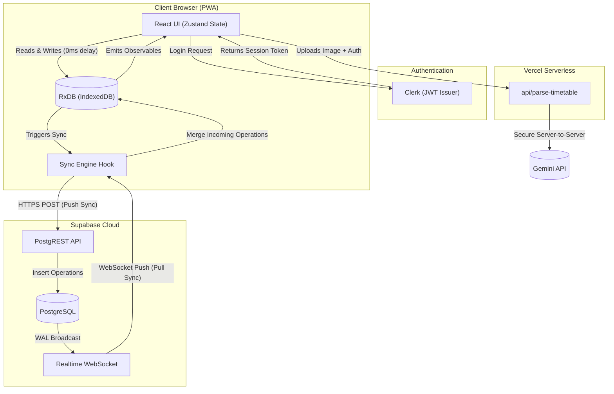

# System Architecture Document (SAD)
## ZeroLag — Local-First Project Management Platform

**Version:** 1.0

---

## 1. Introduction
This System Architecture Document provides a high-level overview of the ZeroLag infrastructure, network topology, and core data flow. ZeroLag abandons traditional client-server request/response paradigms in favor of a "Local-First, Event-Driven Sync" architecture.

---

## 2. High-Level Architectural Paradigm
ZeroLag operates on an **Offline-First / Local-First** paradigm. 
- **The Browser is the Primary Database**: The React frontend does not read from the cloud; it reads exclusively from an in-browser database (IndexedDB via RxDB).
- **Asynchronous Replication**: Changes are written locally and immediately reflected in the UI. A background Sync Engine acts as a sidecar, pushing local operations to the cloud and pulling remote operations down to the client.
- **Event-Driven Subscriptions**: The application subscribes to a WebSocket channel to receive remote database changes in real time.

---

## 3. Network Boundaries & Data Flow

---

## 4. System Components & Topology

### 4.1 Client-Side Application (PWA)
- **Environment**: Web Browser (V8/WebKit).
- **Core Framework**: React (Vite) as a Single Page Application (SPA).
- **Architecture**: Organized using **Feature-Sliced Design (FSD)** methodology. The codebase is heavily modularized (e.g., `src/features/boards/`, `src/features/auth/`), ensuring clear boundaries between UI components, business logic, and routing. Shared layers live in `src/db/` and `src/hooks/`.
- **Local Storage**: IndexedDB is used for structured persistent storage, wrapped by `RxDB` (Reactive Database) which provides observables for UI reactivity. `localStorage` is used for ephemeral UI preferences and the sync engine's ledger (`zerolag_local_ops`).

### 4.2 Authentication Layer (Clerk)
- **Integration**: The client app communicates directly with Clerk APIs. Clerk issues JSON Web Tokens (JWTs) which are stored in memory and passed to Supabase for authorized requests.

### 4.3 Remote Backend & Database (Supabase)
- **Role**: Acts as the central "Source of Truth" and the event-broadcaster for all connected peers.
- **Authorization**: Enforced exclusively via PostgreSQL Row Level Security (RLS) using the Clerk JWT context.

### 4.4 Serverless Infrastructure (Vercel)
- **Role**: Secure API proxy for third-party services (e.g., Google Gemini AI).
- **Implementation**: Edge/Serverless API routes (`api/*`) run strictly on the backend. This allows ZeroLag to inject sensitive environment variables (like `GEMINI_API_KEY`) into requests without ever exposing them to the client-side browser payload.
