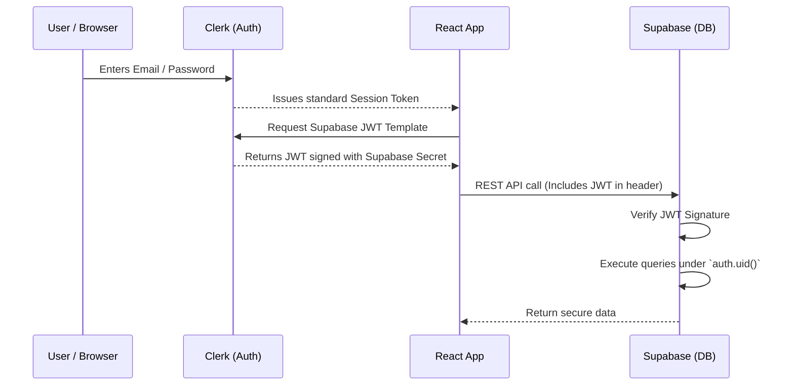

# Security & Authentication

ZeroLag completely eliminates the need for a custom Node.js backend by securely integrating **Clerk** (Edge Authentication) directly with **Supabase** (Database) using Row-Level Security (RLS).

---

## 1. Authentication Flow (Clerk to Supabase)



---

## 2. Authorization Flow (Supabase RLS)
When the React client makes a request to Supabase, it attaches the Clerk JWT.
Supabase verifies the JWT signature. Once verified, it executes SQL queries under the context of the user whose ID is inside the JWT (`auth.uid()`).

### Row-Level Security (RLS) Policies
By default, all tables (`boards`, `board_access`, `operations`) are completely locked down. Data is only accessible if the user meets strict conditions:

#### Board Access Model
We use a mapping table called `board_access` to link users to projects.

```sql
CREATE TABLE board_access (
  board_id VARCHAR(255) NOT NULL,
  user_id VARCHAR(255) NOT NULL,
  PRIMARY KEY (board_id, user_id)
);
```

#### Policy Examples
When a user attempts to read an `operation` to sync their local database, Supabase runs this policy:
```sql
CREATE POLICY "Users can view operations for their boards"
ON operations FOR SELECT
USING (
  EXISTS (
    SELECT 1 FROM board_access 
    WHERE board_access.board_id = operations.board_id 
    AND board_access.user_id = auth.uid()::text
  )
);
```
If the user's `auth.uid()` is not found in `board_access` for that specific board, the query returns 0 rows. 

---

## 3. Link-Sharing Security
ZeroLag allows users to invite collaborators via a "Project Code" (the Board ID).
- Board IDs are standard **UUIDv4** strings.
- UUIDv4 strings are 128-bit numbers, meaning they are cryptographically impossible to guess.
- Because the ID cannot be guessed, treating the ID itself as a bearer token for joining a project is a secure model (similar to Google Drive "Anyone with the link").
