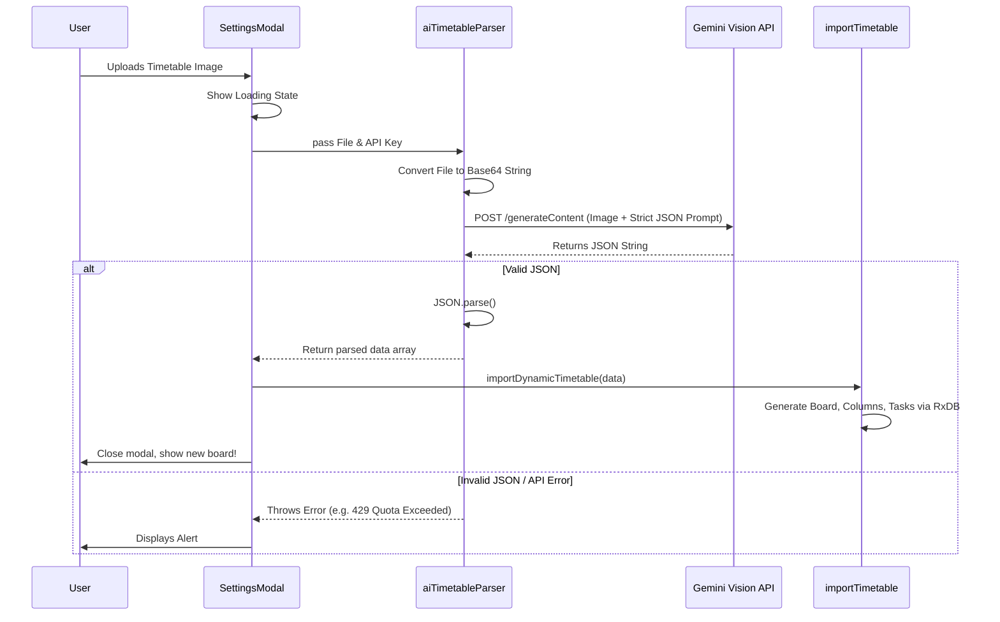

# AI Magic Import Flow

The AI Magic Import feature allows users to upload a raw image of a timetable/schedule and instantly convert it into a fully interactive Kanban board.

---

## 1. Technical Implementation

The feature relies on Google's GenAI Vision API (`gemini-2.5-flash`). It is designed to run completely locally in the browser, passing the Base64 image data directly to Google's API, rather than routing through a middle-tier backend.



---

## 2. The Strict JSON Prompting Strategy
To ensure the vision model does not hallucinate markdown wrappers or conversational text, we pass `config: { responseMimeType: "application/json" }` directly into the `generateContent` configuration.

This enforces the engine to return structurally valid JSON, preventing `SyntaxError: Expected ',' or '}'` exceptions during parsing.

### Fallback Sanitization
Even with the mime-type configuration, we run a fallback regex to strip out any potential markdown backticks that the model might accidentally include in edge cases:

```typescript
const cleanText = text.replace(/```json/gi, '').replace(/```/g, '').trim();
return JSON.parse(cleanText);
```
