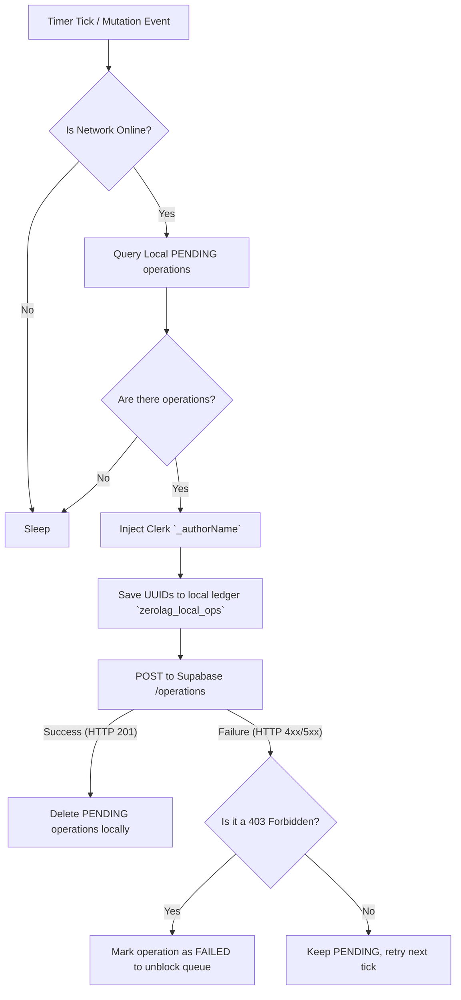
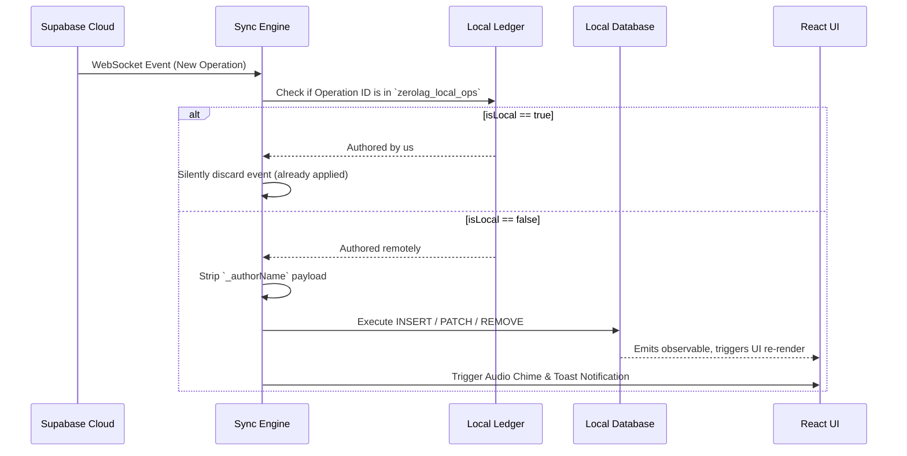

# Sync Engine Architecture

The sync engine (`useSyncEngine.tsx`) is the heart of ZeroLag's offline-first capabilities. It operates as a bidirectional gateway between the RxDB local storage and the Supabase cloud.

---

## 1. The Push Cycle (Local -> Cloud)
When the user is online, the sync engine executes on a polling interval.

---

## 2. The Pull Cycle & Real-Time Sync (Cloud -> Local)

ZeroLag uses WebSockets to receive remote changes instantly.

---

## 3. Conflict Resolution
Conflicts occur when two users modify the same entity simultaneously while offline, and both attempt to sync when they regain connectivity.

### Last-Write-Wins (LWW)
ZeroLag currently utilizes a timestamp-based LWW resolution strategy.
- Every `patch` or `insert` command executed by `handleRemoteOperation` operates strictly on the entity ID.
- Since the Sync Engine processes operations sequentially based on the `timestamp` they were recorded, the operation with the latest timestamp is applied last, effectively overwriting older, conflicting changes.
