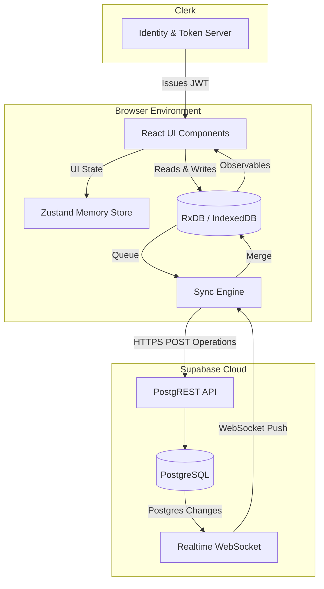

# System Architecture Document (SAD)
## ZeroLag — Local-First Project Management Platform

**Version:** 1.0
**Target Audience:** Software Architects, Lead Developers, DevOps Engineers

---

## 1. Introduction

This System Architecture Document provides a high-level overview of the ZeroLag infrastructure, network topology, and core data flow. ZeroLag abandons traditional client-server request/response paradigms in favor of a "Local-First, Event-Driven Sync" architecture.

---

## 2. High-Level Architectural Paradigm

ZeroLag operates on an **Offline-First / Local-First** paradigm. 
- **The Browser is the Primary Database**: The React frontend does not read from the cloud; it reads exclusively from an in-browser database (IndexedDB via RxDB).
- **Asynchronous Replication**: Changes are written locally and immediately reflected in the UI. A background Sync Engine acts as a sidecar, pushing local operations to the cloud and pulling remote operations down to the client.
- **Event-Driven Subscriptions**: The application subscribes to a WebSocket channel to receive remote database changes in real time.

---

## 3. System Components & Topology

### 3.1 Client-Side Application (PWA)
- **Environment**: Web Browser (V8/WebKit).
- **Core Framework**: React (Vite) as a Single Page Application (SPA).
- **Local Storage**: IndexedDB is used for structured persistent storage, wrapped by `RxDB` (Reactive Database) which provides observables for UI reactivity. `localStorage` is used for ephemeral UI preferences and the sync engine's ledger (`zerolag_local_ops`).
- **Service Worker**: Manages asset caching (via `vite-plugin-pwa`) to allow the application shell to load entirely offline.

### 3.2 Authentication Layer (Clerk)
- **Role**: Identity Provider (IdP) and User Management.
- **Integration**: The client app communicates directly with Clerk APIs. Clerk issues JSON Web Tokens (JWTs) which are stored in memory and passed to Supabase for authorized requests.

### 3.3 Remote Backend & Database (Supabase)
- **Environment**: Managed PostgreSQL Database.
- **Role**: Acts as the central "Source of Truth" and the event-broadcaster for all connected peers.
- **Real-Time Engine**: Utilizes Supabase Realtime (Elixir-based WebSocket server that listens to PostgreSQL WAL - Write Ahead Log).
- **Authorization**: Enforced exclusively via PostgreSQL Row Level Security (RLS) using the Clerk JWT context.

---

## 4. Network Boundaries & Data Flow

---

## 5. Security Architecture

### 5.1 Token Management
- Authentication relies on Clerk issuing a short-lived JWT.
- The JWT is dynamically injected into the Supabase client instance headers. This guarantees that every request sent to the Supabase REST API or WebSocket channel is authenticated.

### 5.2 Row Level Security (RLS)
Supabase enforces access control directly at the database layer. No custom middleware/Node.js server exists between the client and the database.
- The `auth.jwt()` function extracts the Clerk user ID.
- Policies on tables (e.g., `boards`, `tasks`) restrict `SELECT`, `INSERT`, `UPDATE`, and `DELETE` operations so users can only affect rows they own or have been explicitly granted access to.

### 5.3 Data Isolation
- **Local Isolation**: RxDB is initialized with a namespace specific to the logged-in user (`zerolag_{userId}_v3`). If a different user logs into the same browser profile, they receive a completely isolated IndexedDB instance, preventing data leakage.
